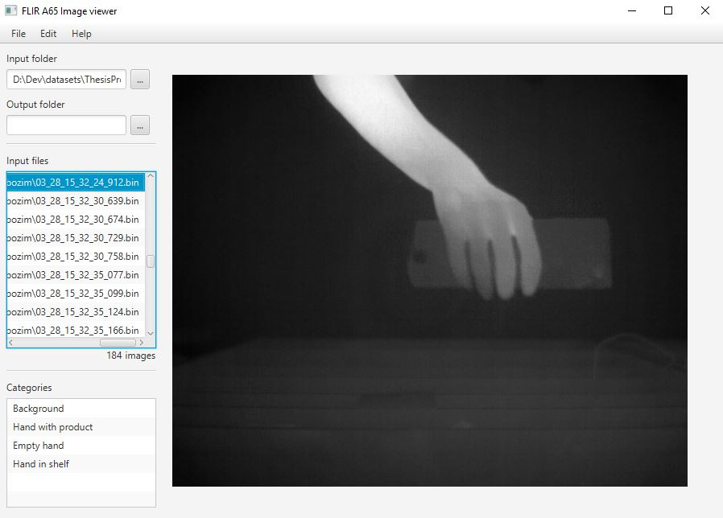

# FLIR image viewer and labeling

This repository contains utility Java application which was created during my 
Bachelor thesis Detecion of products in customer's hand by IR camera (https://github.com/lukasbrchl/Bachelor-thesis-text-sources).
The app is able to read FLIR camera's raw temperature data and view them as an image. 
Images could be also labeled to predefined (hardcoded) categories for classification purposes. 

### Prerequisites
* Java >= 1.8

### Usage
* Clone the repository
```
git clone https://github.com/lukasbrchl/FLIR-camera-image-viewer-and-labeling.git
```
* Change predefined categories if needed in MainController#initListView
* Build and run the app
* Choose input folder with camera temperature data
* Choose output folder for categorized images.
* List through the images and assign categories. Images are automatically copied to the output + selected category folder.

 

### License

This project is licensed under the MIT License - see the [LICENSE](LICENSE) file for details
